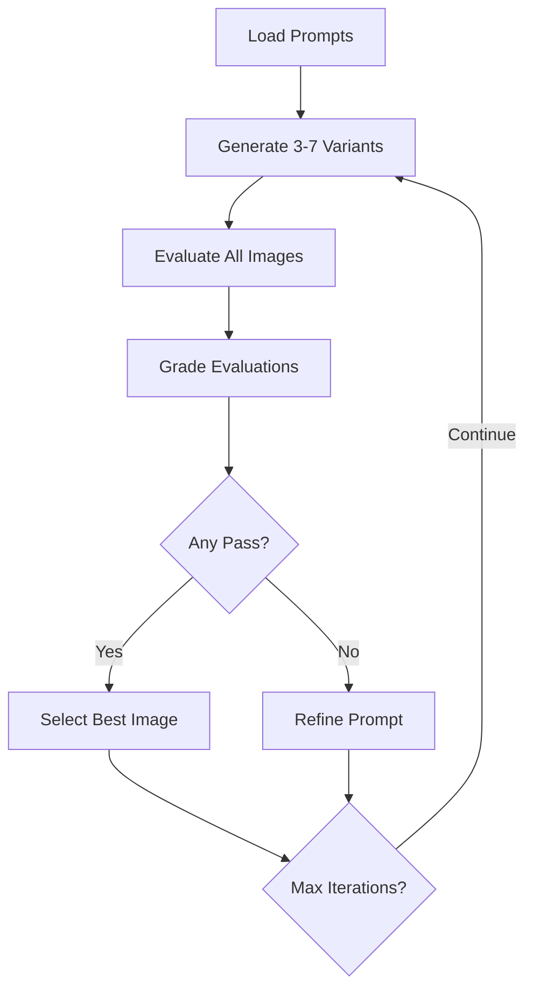

Core Objectives of the Restructuring:

    Multi-Shot Generation
        Enable 3-7 variant images per prompt/iteration
        Track/sort all variants while maintaining file/database coherence

    Iteration Integrity
        Preserve clear lineage: Original Prompt → Iter1 Refined → Iter2 Refined
        Prevent path/database collisions between iterations

    Quality-Driven Workflow
        Codify "survival of the fittest" logic:
            Grade outputs automatically
            Propagate only the best variants forward
            Retain full history for debugging

    Component Specialization
        Isolate critical functions into standalone modules:
            🎨 Generation ↔ ✅ Evaluation ↔ 📝 Grading ↔ 🔍 Selection ↔ ✏️ Refinement

Let's break this down into a structured solution:

### Proposed Architecture
1. **Modular Pipeline Components**
   - `BatchGenerator.py` (Handles multi-shot generation)
   - `ImageEvaluator.py` (Pure image description)
   - `EvaluationGrader.py` (Pass/Fail determination)
   - `BestImageSelector.py` (Quality ranking)
   - `PromptRefiner.py` (Prompt improvement)
   - `PipelineOrchestrator.py` (Main workflow controller)

2. **Naming Convention & Path Strategy**
```python
# Format: {prompt_id}_iter{iteration}_v{variant}.{ext}
# Example: scene_004_iter2_v3.png
def generate_image_path(prompt_id, iteration, variant, output_dir):
    return os.path.join(output_dir, f"{prompt_id}_iter{iteration}_v{variant}.png")
```

3. **Enhanced Database Schema**
```sql
-- Add variant column and quality score
ALTER TABLE generated_images ADD COLUMN variant INTEGER;
ALTER TABLE generated_images ADD COLUMN evaluation_score REAL;

-- New best image tracking
CREATE TABLE best_images (
    prompt_id TEXT PRIMARY KEY,
    iteration INTEGER,
    best_image_id INTEGER,
    FOREIGN KEY(best_image_id) REFERENCES generated_images(ID)
);
```

4. **Pipeline Flow**


### Key Implementation Steps

1. **Multi-Shot Generation**
```python
# BatchGenerator.py
def generate_batch(prompt, iteration, output_dir):
    images = []
    for variant in range(config.BATCH_SIZE):
        path = generate_image_path(prompt['id'], iteration, variant, output_dir)
        images.append({
            'path': path,
            'variant': variant,
            'prompt': prompt['prompt']
        })
        # Your actual generation logic here
    return images
```

2. **Evaluation Grading Separation
```python
# EvaluationGrader.py
def grade_evaluation(original_prompt, evaluation_text):
    # Implementation using your AI grading logic
    return {
        'score': 0.85,
        'passed': True,
        'feedback': 'Needs better lighting contrast'
    }
```

3. **Best Image Selection
```python
# BestImageSelector.py
def select_best(images):
    return max(images, key=lambda x: x['evaluation_score'])
```

4. **Database Integration
```python
# PipelineOrchestrator.py
def save_iteration_results(prompt_id, iteration, variants):
    with DB.transaction():
        for variant in variants:
            DB.insert('generated_images', 
                prompt_id=prompt_id,
                iteration=iteration,
                variant=variant['variant'],
                image_path=variant['path'],
                evaluation_score=variant['score'])
        
        best = select_best(variants)
        DB.upsert('best_images',
            {'prompt_id': prompt_id},
            {'iteration': iteration, 'best_image_id': best['id']})
```

### Recommended Refactoring Steps

1. **Separate Symlink Management**
```python
# SymlinkManager.py
def update_current_image(prompt_id, best_path):
    symlink_path = f"current/{prompt_id}.png"
    if os.path.exists(symlink_path):
        os.unlink(symlink_path)
    os.symlink(best_path, symlink_path)
```

2. **Pipeline Configuration**
```python
# config.py
class PipelineConfig:
    BATCH_SIZE = 5  # 3-7 variants
    MAX_ITERATIONS = 3
    QUALITY_THRESHOLD = 0.7
```

3. **Evaluation Metadata Handling**
```python
# PromptRefiner.py
def refine_prompt(original_prompt, evaluations):
    context = {
        'original': original_prompt,
        'evaluations': [e['text'] for e in evaluations],
        'scores': [e['score'] for e in evaluations]
    }
    # Your refinement logic using AI
    return refined_prompt
```

### Advantages of This Approach

1. **Clear Separation of Concerns**
   - Each component handles one specific responsibility
   - Easy to swap out evaluation/grading implementations

2. **Traceability**
   - Full history of all generated variants
   - Clear path from original to refined prompts
   - Direct mapping between images and their evaluation metadata

3. **Flexible Iteration Control**
   - Easy to adjust batch sizes and quality thresholds
   - Supports partial pipeline restarts
   - Enables different refinement strategies per prompt

4. **Performance Optimization**
   - Batch processing of images
   - Parallel evaluation possible
   - Clear quality metrics for progress tracking